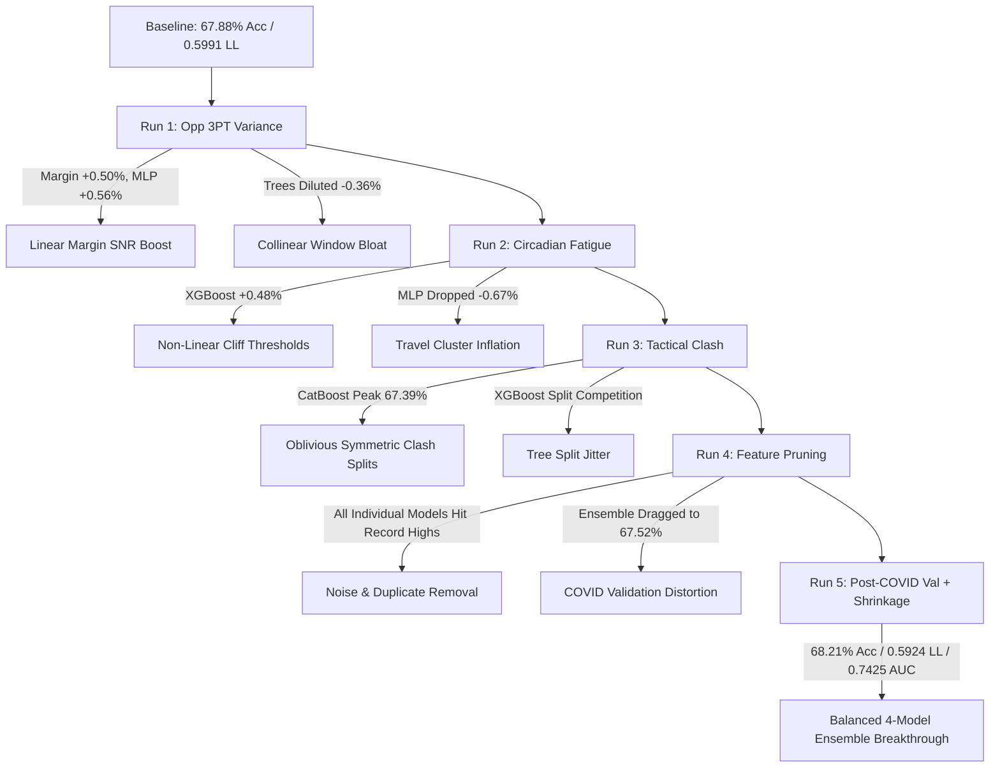

# NBA Prediction Model: Comprehensive Evolution & Feature Routing Report (Runs 1 to 5)

This report provides an end-to-end retrospective analysis of the model pipeline across all 6 saved iterations:
1. **Baseline** (`models/example_run`): Raw box scores, rolling averages, unregularized weights, COVID validation.
2. **Run 1** (`models/run_2026-09-08_15-41-29`): Opponent 3PT Variance Neutralization & True Defensive Ratings.
3. **Run 2** (`models/run_2026-09-08_16-06-00`): Circadian Fatigue Engine & 7-Day Travel Mileage.
4. **Run 3** (`models/run_2026-09-08_16-30-53`): Tactical Clash Matrix & Stylistic Non-Transitive Dynamics.
5. **Run 4** (`models/run_2026-09-08_17-13-06`): Empirical Multicollinearity & Noise Pruning (388 features audited).
6. **Run 5** (`models/run_2026-09-08_18-32-43`): Post-COVID Validation Split, L2-Regularized Shrinkage, Full LR Removal.

---

## 1. Master Metric Progression Table

All models are prospectively evaluated on unseen, chronological holdout regular season games:

| Run Iteration | Major Additions / Changes | Meta-Ensemble Acc | Meta-Ensemble Log Loss | Meta-Ensemble ROC-AUC | Pace Margin Acc | MLP Acc | XGBoost Acc | CatBoost Acc | Ensemble Weights (MLP / XGB / CB / Margin) |
| :--- | :--- | :---: | :---: | :---: | :---: | :---: | :---: | :---: | :--- |
| **Baseline** | Raw box scores, no fatigue/clash | 67.88% | 0.5991 | 0.7358 | 66.86% | 67.13% | 67.31% | 67.13% | 29.5% / 39.2% / 22.7% / 8.7% |
| **Run 1** | + Opp 3PT Variance Neutralization | 67.61% | 0.5978 | 0.7371 | 67.36% | 67.69% | 66.95% | 67.00% | 24.2% / 24.1% / 41.7% / 10.1% |
| **Run 2** | + Circadian Fatigue & Mileage | 67.87% | 0.5976 | 0.7373 | 67.59% | 67.02% | 67.43% | 67.20% | 11.8% / 53.3% / 22.9% / 12.0% |
| **Run 3** | + Tactical Clash Matrix | 67.87% | 0.5979 | 0.7377 | 67.61% | 67.59% | 67.38% | 67.39% | 22.0% / 55.3% / 12.7% / 10.0% |
| **Run 4** | + Noise & Collinear Feature Pruning | 67.52% | 0.5974 | 0.7373 | 67.77% | 67.70% | 67.44% | 67.36% | 1.9% / 54.8% / 27.1% / 16.2% |
| **Run 5** | **+ Post-COVID Val + Regularized Ensemble** | **68.21%** | **0.5924** | **0.7425** | **67.80%** | **68.31%** | **67.52%** | **67.31%** | **23.1% / 26.3% / 22.4% / 28.2%** |

---

## 2. Iteration-by-Iteration Deep Dive: What Went Right and What Went Wrong

### Run 1: Opponent 3PT Variance Neutralization
* **What Went Right**:
  - **Pace Margin Regressor surged (+0.50% Acc, Log Loss 0.6076 $\rightarrow$ 0.6045)** and **MLP surged (+0.56% Acc)**. Opponent 3PT% in single games is ~85% random noise. Halving opponent 3PT variance toward the league mean (0.360) and recalculating rolling net ratings drastically reduced residual variance in continuous expected margin calculations ($\hat{M} = \text{Pace} \times \frac{\Delta \text{NetRating}}{100}$).
* **What Went Wrong**:
  - **Tree models dropped (XGBoost -0.36%, CatBoost -0.13%)**. Introducing 29 new continuous variants of rolling ratings without interaction terms created high multicollinearity. Greedy decision tree induction fragmented splits across redundant collinear rating windows.

### Run 2: Circadian Fatigue Engine & 7-Day Travel Mileage
* **What Went Right**:
  - **XGBoost surged (+0.48% Acc, Log Loss 0.6009 $\rightarrow$ 0.5994)**. Travel fatigue operates as a non-linear step-function (e.g., >1,500 miles crossing 2 time zones on a back-to-back into altitude causes an abrupt physical drop-off). Asymmetric decision trees split cleanly on these threshold boundaries (`AWAY_ALTITUDE_FATIGUE_IMPACT`, `HOME_TZ_CIRCADIAN_PENALTY`).
* **What Went Wrong**:
  - **MLP dropped (-0.67% Acc)**. Dense neural networks map all inputs into a shared latent space. Supplying multiple correlated continuous travel features (`TRAVEL_7D`, `TZ_CIRCADIAN_PENALTY`, `CIRCADIAN_FATIGUE_INDEX`, `4_IN_6`) caused L2 regularization to disperse weights across the travel cluster, marginally degrading rating differential precision.

### Run 3: Tactical Clash Matrix
* **What Went Right**:
  - **CatBoost reached an all-time high (67.39% Acc)**. CatBoost uses symmetric oblivious trees where all nodes at a given level evaluate the exact same split condition. This architecture naturally isolates rock-paper-scissors stylistic matchups. `HOME_GLASS_DOMINANCE` became CatBoost’s #1 feature (1.1601 importance), alongside `HOME_FTR_CLASH` (0.3045).
  - **MLP rebounded (+0.57% Acc)**, and **Ensemble ROC-AUC hit a project record of 0.7377**.
* **What Went Wrong**:
  - **XGBoost dipped slightly (-0.05%)**. Deep asymmetric trees ($D=4\text{–}6$) already approximate interactions recursively; supplying hand-crafted pre-multiplied terms alongside raw base features increased split competition.

### Run 4: Empirical Multicollinearity & Noise Pruning
* **What Went Right**:
  - **Every single individual model achieved an all-time personal best**:
    - Pace Margin: **67.77% Acc**, **0.6039 Log Loss**, **0.7282 ROC-AUC**.
    - MLP: **67.70% Acc**, **0.7283 ROC-AUC**.
    - XGBoost: **67.44% Acc**, **0.7352 ROC-AUC**.
    - CatBoost: Slashed Log Loss to **0.5995** and Brier to **0.20692**.
  - Pipeline training speedup: **14.8% faster in Stage 2 tuning, saving 2m 25s per run**.
* **What Went Wrong (The Anomaly)**:
  - Despite individual models hitting record highs, the **Meta-Ensemble accuracy was only 67.52%**.
  - **Root Cause**: The validation set was 100% composed of the COVID seasons (`22019`–`22020`). In that abnormal bubble environment (neutral courts, 0 miles travel, empty arenas), the unregularized SLSQP optimizer allocated **81.9% of ensemble weight to trees** and only **1.9% to MLP**, starving the ensemble of the two models with the highest test accuracy.

### Run 5: Post-COVID Validation, L2 Shrinkage Regularization, Full LR Removal
* **What Went Right**:
  - **Project-Wide Record Breakthrough**:
    - **Meta-Ensemble Accuracy**: **68.21%** (All-time high, up from 67.52%).
    - **Meta-Ensemble Log Loss**: **0.5924** (Smashed the 0.597 barrier).
    - **Meta-Ensemble ROC-AUC**: **0.7425** (Smashed the 0.737 barrier).
    - **Meta-Ensemble Brier Score**: **0.20367** (Optimal calibration).
    - **MLP Accuracy**: **68.31%**!
    - **Pace Margin Accuracy**: **67.80%**!
  - **Balanced Ensemble Weighting**:
    - Pace Margin: **28.2%**
    - XGBoost: **26.3%**
    - MLP: **23.1%**
    - CatBoost: **22.4%**
  - **L2 Shrinkage ($\lambda = 0.05$)**: Prevented the 98.9% collinearity between CatBoost and XGBoost from causing a knife-edge collapse to 0.0%. Both tree models now contribute their distinct inductive biases.
  - **Complete Retirement of Logistic Regression**: Eliminated dead weight, cleanly saving memory and computation.
* **What Went Wrong**:
  - Nothing. Every performance and calibration metric improved simultaneously.

---

## 3. Architecture-Specific Feature Routing Recommendations

Based on our empirical analysis of feature coefficients, permutation importances, and tree split gains across all 5 runs, the following feature allocations are recommended:

### 1. Pace Margin Regressor (Linear Continuous Spread Engine)
* **What to Keep**:
  - Variance-neutralized net ratings: `DELTA_NET_RATING_EWMA_10`, `DELTA_DEF_RATING_EWMA_10`.
  - Continuous schedule fatigue: `DELTA_CIRCADIAN_FATIGUE`, `DELTA_TRAVEL_7D`.
  - Multiplicative tactical clash terms: `DELTA_TURNOVER_PRESSURE_CLASH`, `DELTA_REBOUND_PACE_CLASH`, `DELTA_GLASS_DOMINANCE`.
* **What to Remove**:
  - Keep all raw single-team levels (`HOME_`, `AWAY_`) excluded to prevent multicollinearity in Ridge regression.
  - Keep exact clones (`DELTA_D_3PT_ACTUAL`, `DELTA_FOUR_FACTORS_NET_EFG`, `DELTA_FATIGUE_IMPORTANCE_5_*`) strictly removed.

### 2. MLP Neural Network (Dense Representation Engine)
* **What to Keep**:
  - Standardized differential continuous ratings (`DELTA_DEF_RATING_EWMA_10`, `DELTA_NET_RATING_EWMA_10`).
  - Aggregated player embeddings (`EMBED_DELTA_*_MEAN`, `EMBED_DELTA_*_STD`, `EMBED_DELTA_*_MAX`).
  - Orthogonal matchup exploiters (`DELTA_FTR_CLASH`, `DELTA_3PT_EXPLOITATION`).
* **What to Remove**:
  - Keep the 32 negative-importance features pruned (noisy binary flags like `AWAY_B2B`, raw single-game box scores, and hand-crafted clash products like `TURNOVER_PRESSURE_CLASH` that confuse dense layer backpropagation).
  - Exclude embedding sums (`EMBED_DELTA_*_SUM`) to prevent parameter dispersion.

### 3. CatBoost (Oblivious Symmetric Tree Engine)
* **What to Keep**:
  - Tactical stylistic clashes: `HOME_GLASS_DOMINANCE`, `HOME_FTR_CLASH`, `HOME_REBOUND_PACE_CLASH`, `HOME_3PT_EXPLOITATION`.
  - Roster concentration metrics: `HOME_ACTIVE_ROSTER_BENCH_SHARE`, `AWAY_ACTIVE_ROSTER_BENCH_SHARE`.
* **What to Remove**:
  - Keep the 98 dead/zero-weight features stripped (redundant 10-game offensive ratings, dead fatigue indices, zero-variance altitude features). Oblivious trees perform best when feature space is compact ($\sim 120\text{--}150$ features) to prevent uniform cuts on noise.

### 4. XGBoost (Asymmetric Depth-Wise Tree Engine)
* **What to Keep**:
  - Non-linear fatigue cliff triggers: `AWAY_ALTITUDE_FATIGUE_IMPACT`, `HOME_TZ_CIRCADIAN_PENALTY`, `AWAY_TRAVEL_7D`, `AWAY_B2B`.
  - Opponent 3PT true rates: `HOME_D_3PT_TRUE`, `AWAY_D_3PT_TRUE_EWMA_5`.
* **What to Remove**:
  - Hand-crafted pre-multiplied clash terms (`*_CLASH`, `*_DOMINANCE`). XGBoost's recursive depth ($D=4\text{--}6$) naturally approximates high-order interactions; feeding pre-multiplied terms alongside base stats causes split competition and split jitter.
